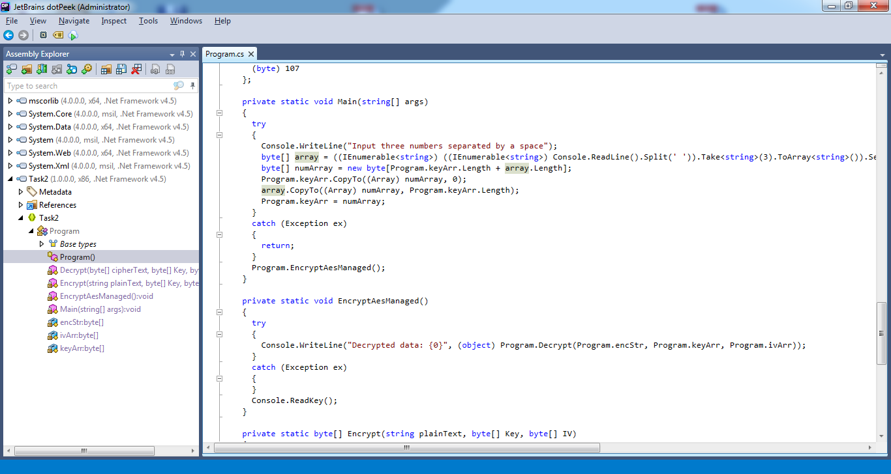

# Power

Open your favourite reverse tool for .net (dotPeek or any).

Note that app asks to input 3 numbers, convers them to byte (meaning our input should be 0-255) and then appends to keyArr.
Later keyArr used to decrypt the secret, if inputed numbers are correct - data is decrypted correctly and being printed, if not - exception is being thrown as padding is not correct.
To find the numbers we need to brute force them. We need to try 256*256*256 combinations which should be quick, to do so we can either copy the code, add the cycle and run it, or create the script that will pass all required combinations to app and will grep result by "Decrypted data" keyword.
