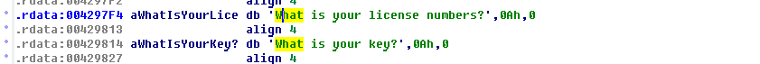
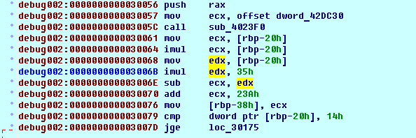
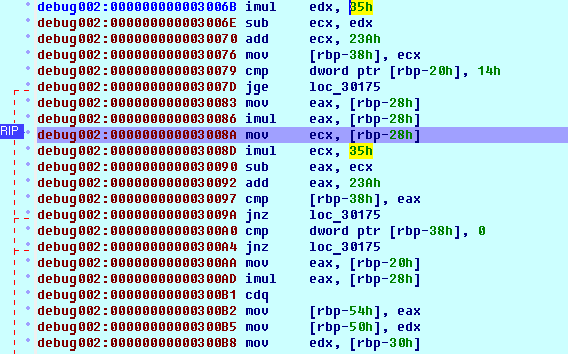
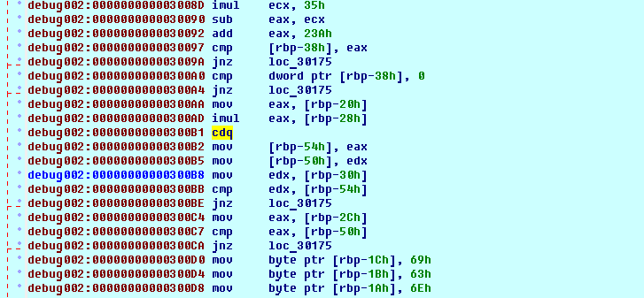

# Protected

If we run the app, we will see the "What is your license numbers?" message.
Let's try to find it in the Strings view of decompiler:

Strange, it is not being accessed from the code, otherwise we would have the address right away (spoiler: part of the code is being unpacked/decrypted in a runtime).
Ok, let's set up the hardware breakpoint on it and run the app.

During the run we hit the breakpoint and afterseveral returns from ofstream (print) functions we see this picture:

here we can safely assume that sub_402250 is an input function as we being asked to input 2 numbers before being asked for key.

First input, let's call it a which stored at rbp-20h, undergoing the following calculations: 'a**2 - 0x35*a + 0x23a' (let's name the result X which is stored in rbp-38h) and compared to 0x14 (=20). If it is >=20 we jump to end of function, so first input must be less than 20.

As you can see later in the code the same formula being applied to second input, b. Y=b**2 - 0x35*a + 0x23a.
Next X being compared to Y, if they are not equal, we go to return.
Next (at 0x300A0) X being compared to zero, and if it is not zero - we go to return.
So, we have X=Y=0, which means a and b are roots of the equation x**2-53*x+270=0, so, by solving it and considering that a<20, we get that a=15, b=38

At last a multiplied by b (line 0x300AD) and then compared to our third input (key), so our third input must be 570.
By inputing those three numbers in the app we get the flag at last.
